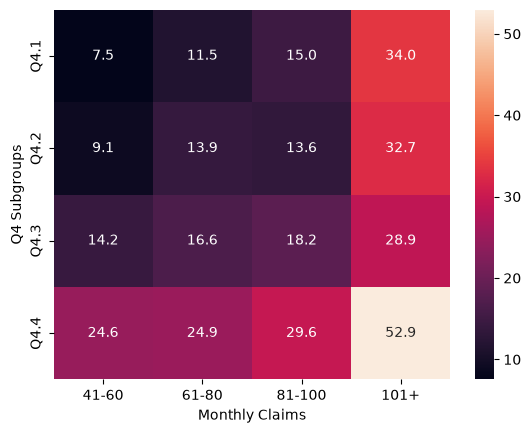
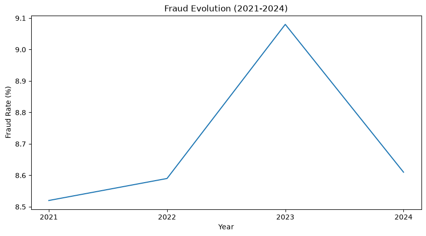

# Healthcare Fraud Detection Analysis

## Objective
Exploratory data analysis of healthcare insurance claims to identify
patterns associated with fraudulent claims, applying prior experience
as a claims analyst in insurance.

## Dataset
Healthcare Fraud Detection Dataset, source: Kaggle ([link](https://www.kaggle.com/datasets/esseasd/healthcare-fraud-detection-dataset))

## Business Questions
1. Where is fraud concentrated? (by specialty, insurance type, state, visit type)
2. How does Claim_Amount differ from Approved_Amount? Are there patterns in reductions/rejections?
3. Does Days_Between_Service_and_Claim differ between fraudulent and non-fraudulent claims?
4. Do providers with high monthly claim volume show more fraud?
5. Are Chronic_Condition_Flag or Prior_Visits_12m related to larger claims or fraud?
6. How does fraud evolve over time?
7. Final recommendation: top red flags the analysis team should monitor.

## Key Findings



Claim amount is the strongest fraud indicator, and this risk compounds when combined with high provider claim volume — reaching a 52.9% fraud rate when both factors are at their highest.

**Fraudulent claims are submitted much faster.** On average, fraudulent claims are submitted in 5.06 days, compared to 15.07 days for non-fraudulent ones — a gap of nearly 10 days that holds regardless of claim status.

**Fraudulent claims are approved at a much lower rate.** Even when a claim ends up Approved, fraudulent ones recognize only 62.62% of the claimed amount on average, compared to 87.24% for non-fraudulent claims — suggesting the approval system is already partially flagging risk through the amount it recognizes.



Fraud has remained consistent from 2021 to 2024, ranging between 8.52% and 9.08%. 2023 was the year with the most fraudulent claims, 416, which represented a 9.08% fraud rate that year.

## Recommendations

1. Rigorous check on those providers with high claim volume per month.
2. Strict approval process has to be implemented for claims with high amount.
3. Extra revision for claims submitted under 5 days could further reduce the fraud rate.
4. Automatic review for claims where the approved amount is disproportionately lower than the claimed amount.

## Stack
- SQL (DuckDB)
- Pandas
- Seaborn / Matplotlib

## Status
Done

## How to run it
```
git clone https://github.com/jscode-1302/claims_analysis.git
cd claims_analysis

# virtual env
python -m venv venv
source venv/bin/activate

# install dependencies
pip install -r requirements.txt

# run
jupyter notebook
```